# SuperCenter

> Bug排查能力提升指南

## 目录
1. [Bug排查基本原则](#1-bug排查基本原则)
2. [复现问题](#2-复现问题)
3. [收集信息](#3-收集信息)
4. [定位问题](#4-定位问题)
5. [沟通协作](#5-沟通协作)
6. [常用工具详解](#6-常用工具详解)
7. [不同类型Bug排查思路](#7-不同类型bug排查思路)
8. [排查能力提升](#8-排查能力提升)

---

## 1. Bug排查基本原则

### 1.1 核心思维

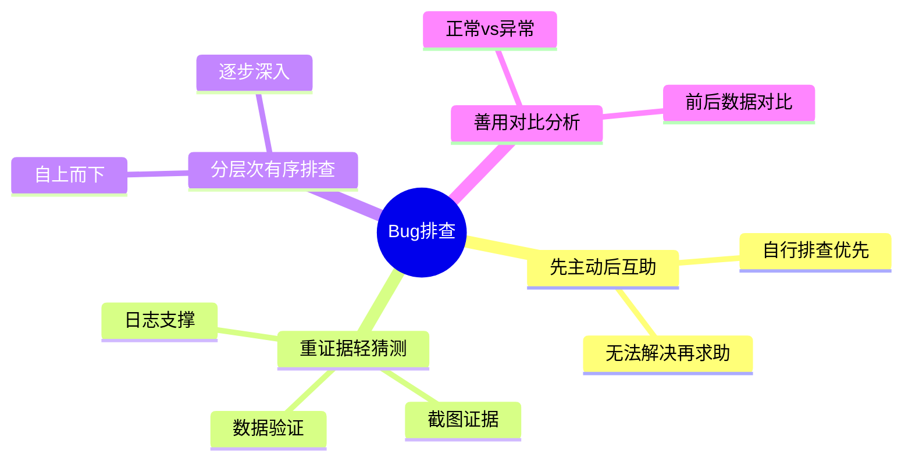

### 1.2 排查效率口诀

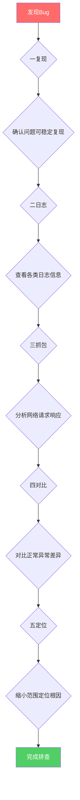

### 1.3 常见误区
| 误区 | 正确做法 |
|------|----------|
| 发现问题直接抛给开发 | 先自行排查，积累经验 |
| 日志看个大概就下结论 | 完整查看日志上下文 |
| 只看错误日志 | 结合正常日志对比分析 |
| 忽略环境差异 | 记录完整环境信息 |
| 复现步骤模糊 | 整理清晰可执行的复现步骤 |

---

## 2. 复现问题

### 2.1 复现的重要性

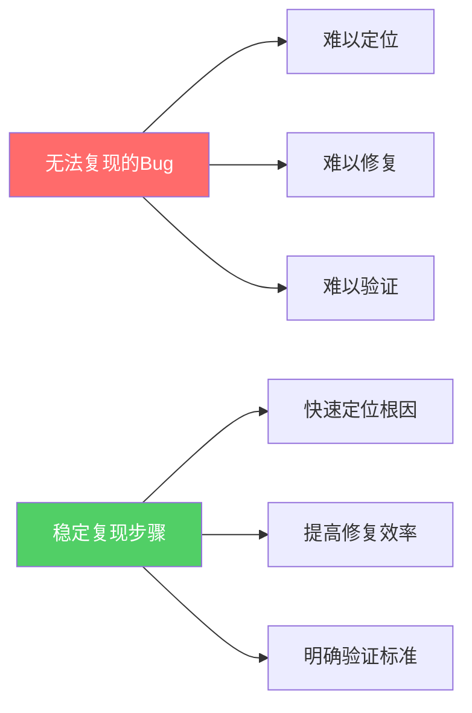

### 2.2 复现步骤编写规范

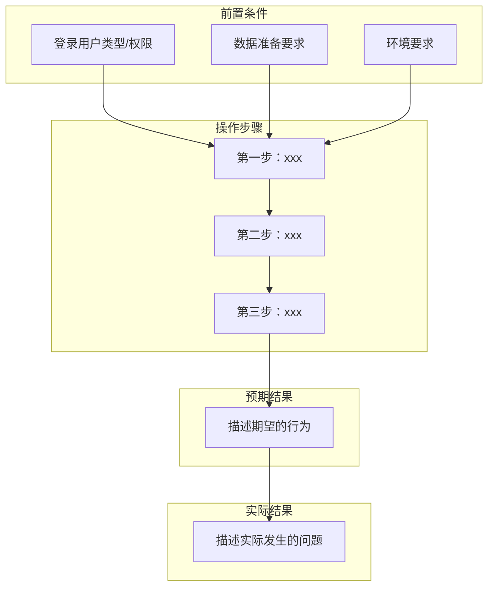

### 2.3 复现环境记录清单

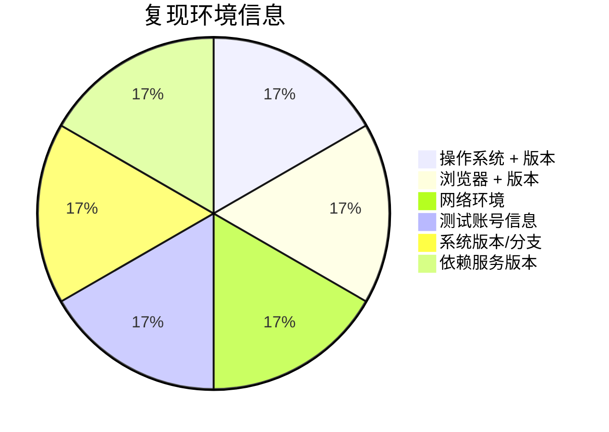

### 2.4 偶发性Bug处理

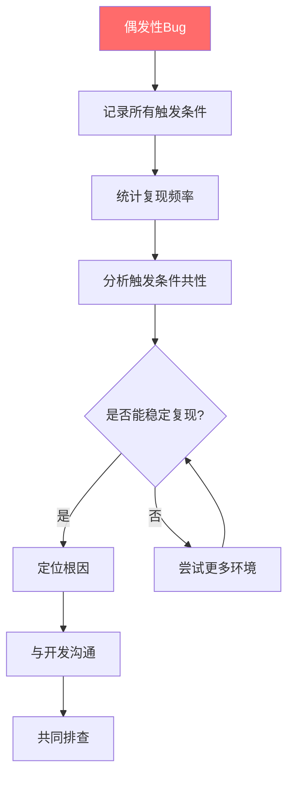

---

## 3. 收集信息

### 3.1 日志分析

#### 3.1.1 日志级别说明
| 级别 | 说明 | 排查重点 |
|------|------|----------|
| ERROR | 错误 | 必看，寻找异常根因 |
| WARN | 警告 | 可能的问题信号 |
| INFO | 信息 | 了解业务流程 |
| DEBUG | 调试 | 详细排查时使用 |

#### 3.1.2 日志级别优先级图

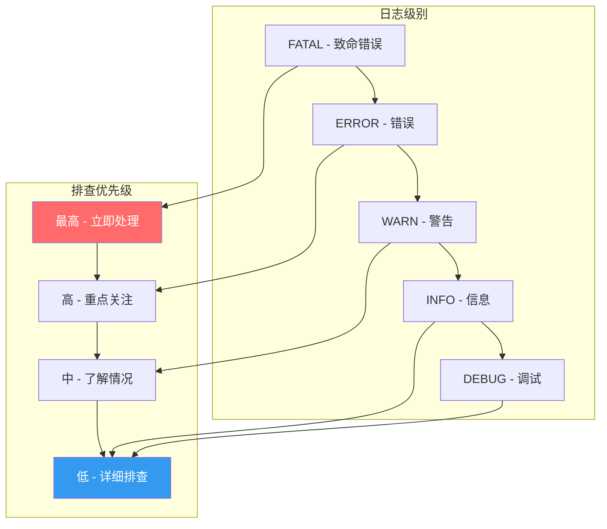

#### 3.1.3 日志查看技巧
```bash
# 查看最新日志
tail -f app.log

# 搜索包含关键字的日志
grep "userId=123" app.log

# 查看某个时间范围的日志
grep "2024-01-01 10:00" app.log

# 查看异常堆栈
grep -A 10 "Exception" app.log
```

#### 3.1.4 日志分析要点

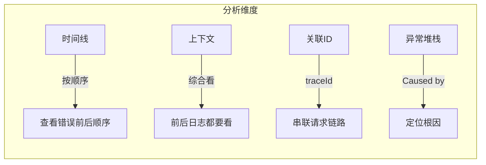

### 3.2 网络请求分析

#### 3.2.1 请求排查要点
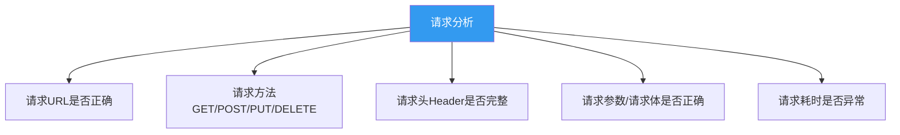

#### 3.2.2 响应排查要点
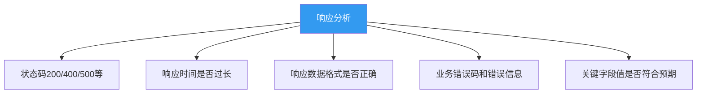

### 3.3 数据库状态检查

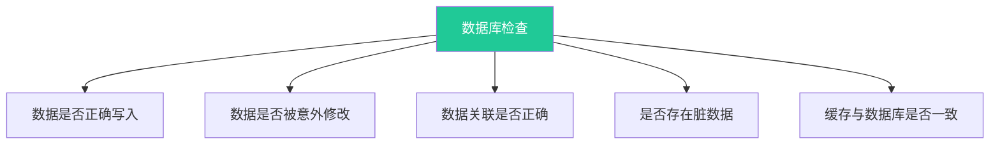

### 3.4 其他信息收集

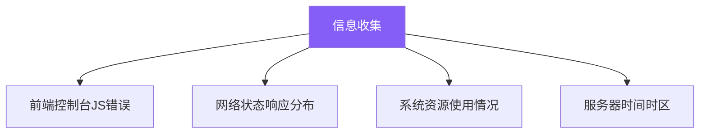

---

## 4. 定位问题

### 4.1 问题定位方法

#### 4.1.1 排除法

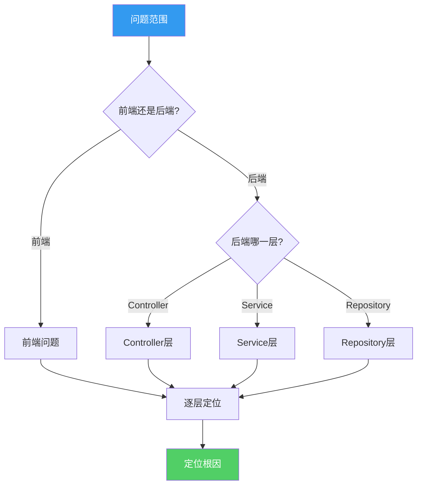

#### 4.1.2 对比法
| 对比维度 | 对比内容 |
|----------|----------|
| 用户维度 | 正常用户 vs 异常用户的数据 |
| 环境维度 | 测试环境 vs 生产环境配置 |
| 浏览器维度 | Chrome vs Firefox vs Safari |
| 系统维度 | Windows vs Mac vs Linux |

#### 4.1.3 假设验证法

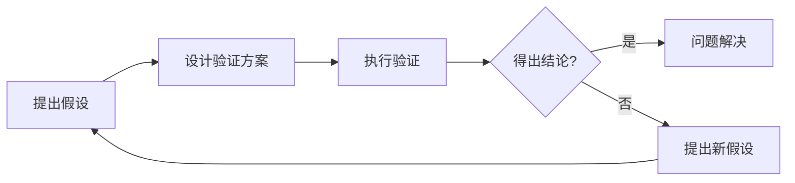

### 4.2 前端问题定位

#### 常见前端Bug类型
| 类型 | 表现 | 排查方法 |
|------|------|----------|
| 页面显示问题 | 样式错乱、布局异常 | 检查CSS、浏览器兼容 |
| 数据展示问题 | 数据不对、空数据 | 检查数据来源和渲染逻辑 |
| 交互无响应 | 点击无反应 | 检查事件绑定、JS错误 |
| 白屏/加载失败 | 页面无法显示 | 检查网络请求、控制台错误 |

#### 前端排查流程

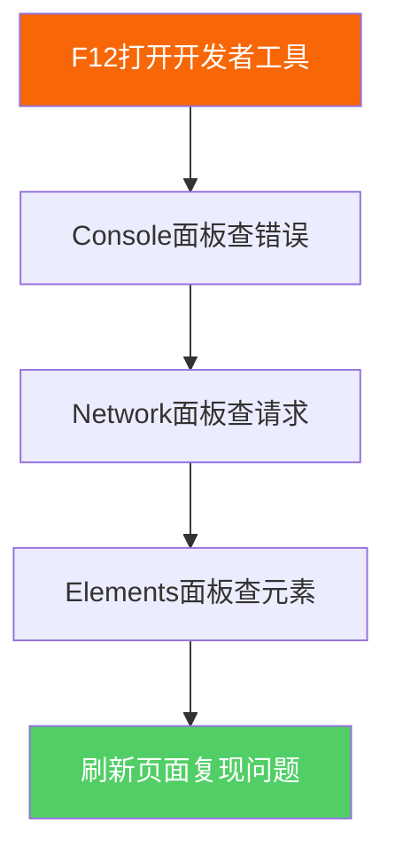

### 4.3 后端问题定位

#### 常见后端Bug类型
| 类型 | 表现 | 排查方法 |
|------|------|----------|
| 接口超时 | 请求长时间无响应 | 检查服务状态、数据库连接 |
| 接口报错 | 返回500等错误码 | 查看后端日志、异常堆栈 |
| 业务逻辑错误 | 数据处理结果不对 | 检查代码逻辑、调试日志 |
| 并发问题 | 偶发性数据异常 | 检查锁、事务、缓存一致性问题 |

#### 后端排查流程

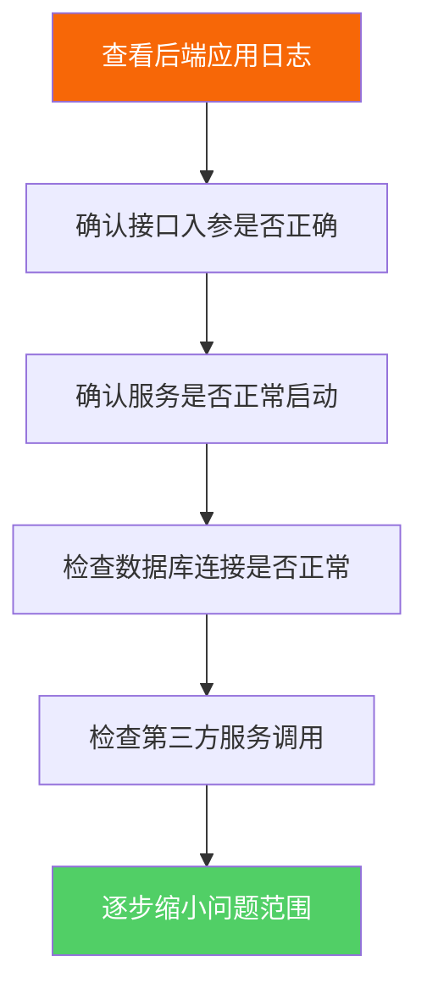

### 4.4 接口问题定位

#### 接口问题排查矩阵

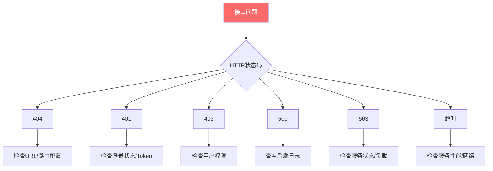

---

## 5. 沟通协作

### 5.1 Bug报告规范

#### Bug报告模板
```markdown
## Bug标题
简洁明了描述问题

## 严重程度
P0/P1/P2/P3（P0最高）

## 复现环境
- 操作系统：
- 浏览器：
- APP版本：
- 网络环境：

## 复现步骤
1.
2.
3.

## 预期结果
描述期望的行为

## 实际结果
描述实际发生的问题

## 复现频率
必现/偶发（X%）

## 日志/截图/抓包
粘贴相关证据

## 附件
相关文件
```

### 5.2 与开发沟通技巧

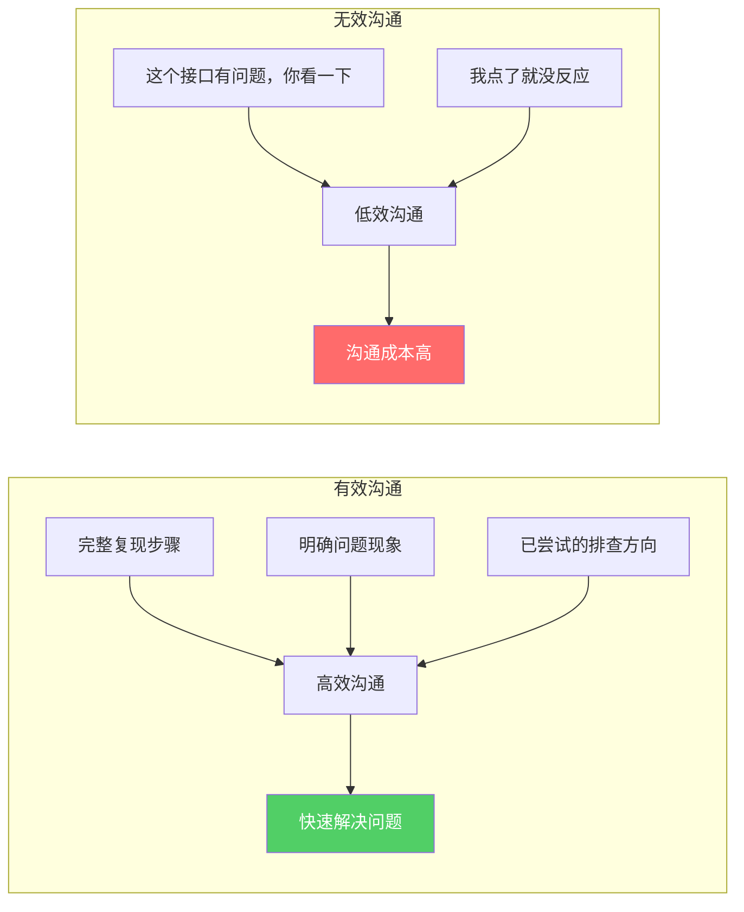

### 5.3 复测验证

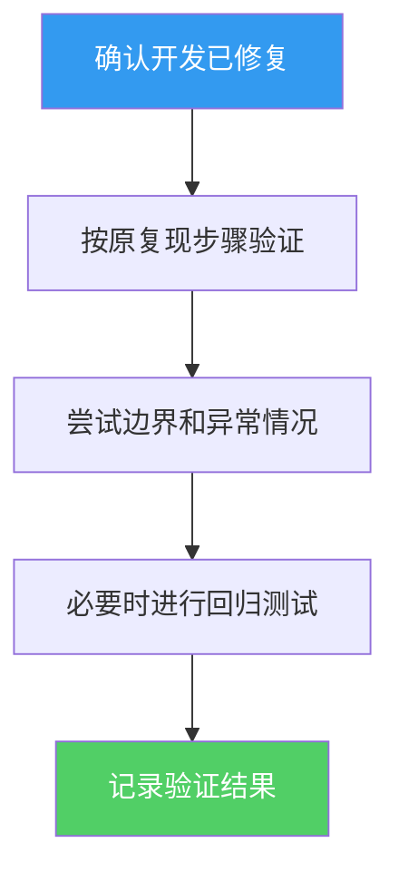

---

## 6. 常用工具详解

### 6.1 浏览器开发者工具（F12）

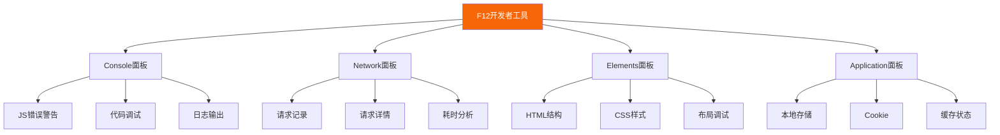

### 6.2 Fiddler/Charles 抓包工具

```mermaid
flowchart TD
    T[抓包工具] --> F1[拦截HTTP/HTTPS请求]
    T --> F2[修改请求响应数据]
    T --> F3[模拟弱网环境]
    T --> F4[排查第三方接口]

    F1 --> S1[APP抓包排查]
    F2 --> S2[请求重放测试]
    F3 --> S3[弱网测试]
    F4 --> S4[第三方问题排查]

    style T fill:#f76707,color:#fff
```

### 6.3 工具使用场景图

```mermaid
pie title 排查工具使用场景
    "浏览器F12" : 35
    "抓包工具" : 25
    "数据库客户端" : 15
    "日志工具" : 15
    "其他工具" : 10
```

### 6.4 数据库客户端

```mermaid
flowchart TD
    DB[数据库工具] --> N[Navicat]
    DB --> S[SQLyog]
    DB --> D[DBeaver]

    N --> NU[数据验证]
    N --> ND[问题数据查找]
    S --> SD[数据修复]
    D --> DC[数据库管理]

    style DB fill:#20c997,color:#fff
```

### 6.5 其他工具

| 工具 | 用途 |
|------|------|
| XShell/SecureCRT | 服务器远程连接 |
| WinSCP/FileZilla | 文件传输 |
| Xmind | 排查思路整理 |
| Notepad++/VSCode | 日志查看分析 |

---

## 7. 不同类型Bug排查思路

### 7.1 界面显示类Bug

```mermaid
flowchart TD
    A[界面显示Bug] --> B{前端还是后端?}
    B -->|前端| C[检查HTML结构]
    C --> D[检查CSS样式]
    D --> E[检查浏览器兼容性]
    E --> F[检查JS动态渲染]
    B -->|后端| G[检查接口返回数据]
    G --> H[检查数据格式]

    style A fill:#ff6b6b,color:#fff
    style F fill:#51cf66,color:#fff
```

### 7.2 功能异常类Bug

```mermaid
flowchart TD
    A[功能异常Bug] --> B[抓包查看接口请求响应]
    B --> C[查看后端日志]
    C --> D[检查业务逻辑代码]
    D --> E[检查数据状态]
    E --> F{定位问题}

    F --> |接口入参| G1[接口问题]
    F --> |逻辑错误| G2[代码问题]
    F --> |数据不对| G3[数据问题]
    F --> |权限问题| G4[权限问题]

    style A fill:#ff6b6b,color:#fff
    style G1 fill:#f76707,color:#fff
    style G2 fill:#f76707,color:#fff
    style G3 fill:#f76707,color:#fff
    style G4 fill:#f76707,color:#fff
```

### 7.3 性能相关Bug

```mermaid
flowchart TD
    A[性能Bug] --> B[确定性能指标]
    B --> C{前端还是后端?}

    C -->|前端| D1[检查资源文件大小]
    D1 --> D2[检查请求数量]
    D2 --> D3[优化前端性能]

    C -->|后端| E1[检查SQL效率]
    E1 --> E2[检查索引]
    E2 --> E3[检查接口耗时]
    E3 --> E4[优化后端性能]

    C -->|服务器| F1[检查CPU内存]
    F1 --> F2[检查磁盘IO]
    F2 --> F3[资源扩容/优化]

    style A fill:#ff6b6b,color:#fff
    style D3 fill:#51cf66,color:#fff
    style E4 fill:#51cf66,color:#fff
    style F3 fill:#51cf66,color:#fff
```

### 7.4 兼容性Bug

```mermaid
flowchart TD
    A[兼容性Bug] --> B[确认问题环境]
    B --> C[在其他环境验证]
    C --> D{能否复现?}

    D -->|能| E[对比环境差异]
    D -->|否| F[检查特定配置]

    E --> G[浏览器版本差异]
    E --> H[操作系统差异]
    E --> I[屏幕分辨率差异]
    E --> J[APP版本差异]
    E --> K[SDK版本差异]

    style A fill:#ff6b6b,color:#fff
```

### 7.5 偶发性Bug

```mermaid
flowchart TD
    A[偶发性Bug] --> B[记录所有触发条件]
    B --> C[统计复现频率]
    C --> D[分析触发条件共性]
    D --> E[尝试稳定复现]
    E --> F[检查并发/竞态问题]

    F --> |竞态条件| G1[加锁/同步处理]
    F --> |缓存问题| G2[缓存一致性]
    F --> |网络问题| G3[网络波动处理]
    F --> |内存问题| G4[内存泄漏检查]
    F --> |定时问题| G5[时序问题排查]

    style A fill:#ff6b6b,color:#fff
    style G1 fill:#51cf66,color:#fff
    style G2 fill:#51cf66,color:#fff
    style G3 fill:#51cf66,color:#fff
    style G4 fill:#51cf66,color:#fff
    style G5 fill:#51cf66,color:#fff
```

---

## 8. 排查能力提升

### 8.1 基础知识要求

```mermaid
flowchart TD
    subgraph 前端基础
        A1[HTML/CSS] --> A[前端问题排查]
        A2[JavaScript] --> A
        A3[浏览器原理] --> A
        A4[HTTP协议] --> A
    end

    subgraph 后端基础
        B1[后端语言] --> B[后端问题排查]
        B2[数据库SQL] --> B
        B3[HTTP深入] --> B
        B4[接口设计] --> B
    end

    subgraph 系统基础
        C1[Linux命令] --> C[系统问题排查]
        C2[Git版本控制] --> C
        C3[Docker容器] --> C
        C4[服务器知识] --> C
    end

    A --> D[综合排查能力]
    B --> D
    C --> D

    style D fill:#845ef7,color:#fff
```

### 8.2 排查能力评估金字塔

```mermaid
flowchart TD
    L5[L5 指导他人] --> L4[L4 疑难杂症]
    L4[L4 疑难杂症] --> L3[L3 复杂问题]
    L3[L3 复杂问题] --> L2[L2 常见Bug]
    L2[L2 常见Bug] --> L1[L1 复现问题]

    L1[独立复现问题<br/>收集基本信息]
    L2[定位常见Bug<br/>有效沟通]
    L3[处理复杂问题<br/>系统化思路]
    L4[解决疑难杂症<br/>全局排查能力]
    L5[指导他人<br/>建立团队规范]

    style L1 fill:#51cf66,color:#fff
    style L2 fill:#339af0,color:#fff
    style L3 fill:#845ef7,color:#fff
    style L4 fill:#f76707,color:#fff
    style L5 fill:#ff6b6b,color:#fff
```

### 8.3 方法论提升

```mermaid
mindmap
  root((方法论))
    5Why分析法
      追根溯源
      连续追问为什么
    MECE分析法
      全面分析
      不重不漏
    番茄工作法
      专注排查
      时间盒管理
    思维导图
      整理思路
      清晰可视化
```

### 8.4 学习资源推荐

#### 书籍推荐

```mermaid
flowchart LR
    subgraph 必读书籍
        H[HTTP权威指南]
        J[JavaScript高级程序设计]
        L[鸟哥的Linux私房菜]
        S[高性能SQL]
    end
```

#### 网站推荐
| 类型 | 推荐网站 |
|------|----------|
| 文档 | MDN Web Docs |
| 技术社区 | 掘金、知乎、Stack Overflow |
| 实践平台 | LeetCode、GitHub、Postman |

---

## 附录

### 附录A：常用端口号
| 服务 | 端口 | 图示 |
|------|------|------|
| HTTP | 80 | 🌐 |
| HTTPS | 443 | 🔒 |
| MySQL | 3306 | 🗄️ |
| PostgreSQL | 5432 | 🐘 |
| Redis | 6379 | ⚡ |
| MongoDB | 27017 | 🍃 |
| Elasticsearch | 9200 | 🔍 |

### 附录B：HTTP状态码速查

```mermaid
flowchart TD
    subgraph 2xx 成功
        A200[200 成功]
    end

    subgraph 3xx 重定向
        A301[301 永久重定向]
        A302[302 临时重定向]
    end

    subgraph 4xx 客户端错误
        A400[400 请求参数错误]
        A401[401 未授权]
        A403[403 禁止访问]
        A404[404 资源不存在]
    end

    subgraph 5xx 服务端错误
        A500[500 服务器内部错误]
        A502[502 网关错误]
        A503[503 服务不可用]
        A504[504 网关超时]
    end

    style A200 fill:#51cf66,color:#fff
    style A400 fill:#ff6b6b,color:#fff
    style A401 fill:#f76707,color:#fff
    style A403 fill:#f76707,color:#fff
    style A404 fill:#f76707,color:#fff
    style A500 fill:#ff6b6b,color:#fff
```

### 附录C：日志级别速查
| 级别 | 颜色标识 | 使用场景 |
|------|----------|----------|
| DEBUG | 🔵 蓝色 | 调试信息，开发环境使用 |
| INFO | 🟢 绿色 | 一般信息，记录正常流程 |
| WARN | 🟡 黄色 | 警告信息，可能存在问题 |
| ERROR | 🔴 红色 | 错误信息，需要关注 |
| FATAL | ⚫ 黑色 | 致命错误，需要立即处理 |

### 附录D：Bug严重程度定义

```mermaid
flowchart TD
    P0[P0 致命<br/>系统崩溃/数据丢失] --> P1[P1 严重<br/>核心功能不可用]
    P1 --> P2[P2 中等<br/>非核心功能异常]
    P2 --> P3[P3 轻微<br/>UI/体验问题]

    style P0 fill:#ff6b6b,color:#fff
    style P1 fill:#f76707,color:#fff
    style P2 fill:#339af0,color:#fff
    style P3 fill:#51cf66,color:#fff
```

---

## Bug排查知识图谱总结

```mermaid
mindmap
  root((Bug排查全貌))
    问题报告
      复现步骤
      环境信息
      证据截图
    信息收集
      日志分析
      抓包排查
      数据库检查
    问题定位
      排除法
      对比法
      假设验证
    沟通协作
      有效报告
      高效沟通
      复测验证
    工具使用
      浏览器F12
      Fiddler/Charles
      数据库客户端
      日志工具
    能力提升
      基础知识
      方法论
      经验积累
```

---

## 更新记录

| 版本 | 日期 | 更新内容 |
|------|------|----------|
| 1.0 | 2026-03-31 | 初始版本 |
| 1.1 | 2026-03-31 | 增加Mermaid图表，图文结合 |

---

*本文档由Claude协助生成，欢迎提出修改建议。*
